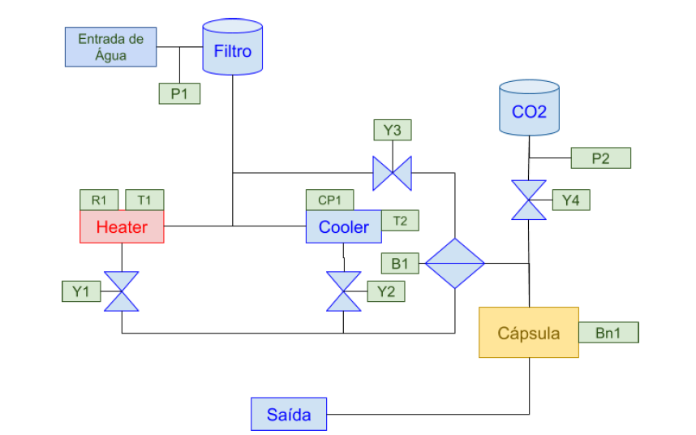
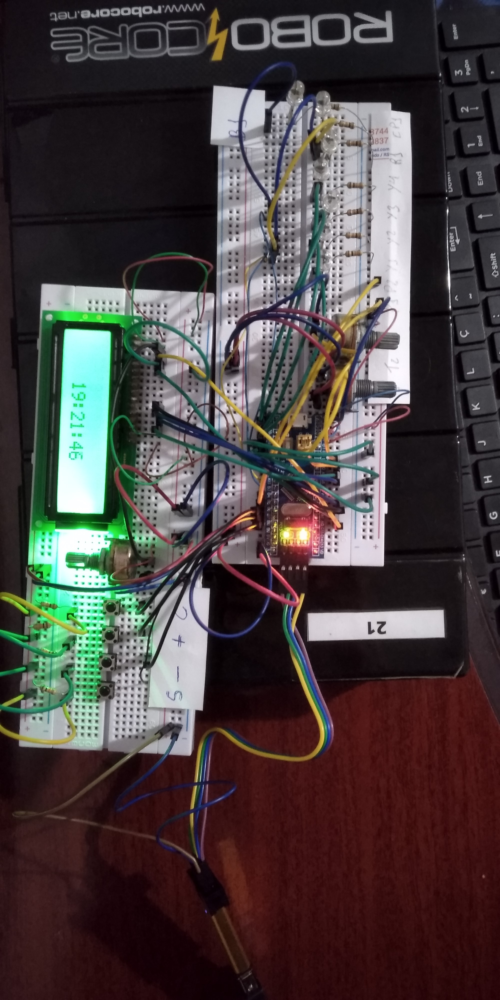
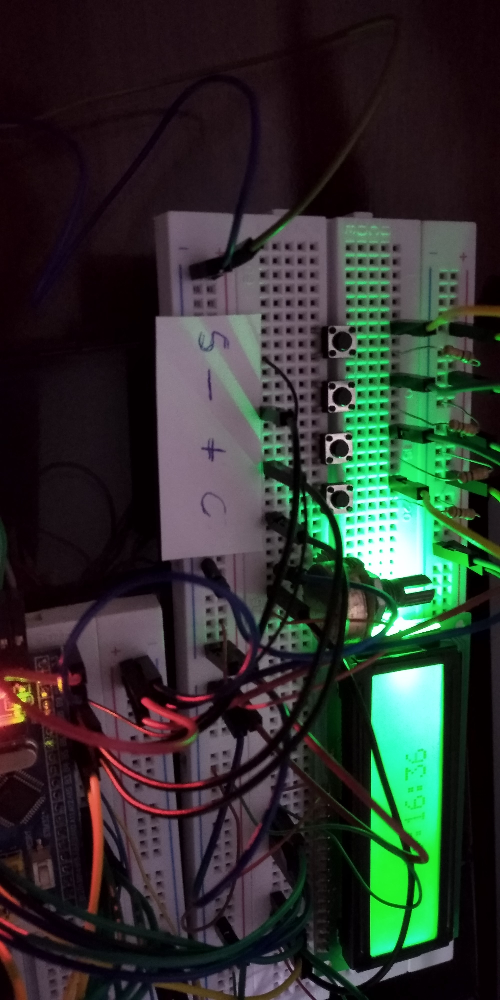
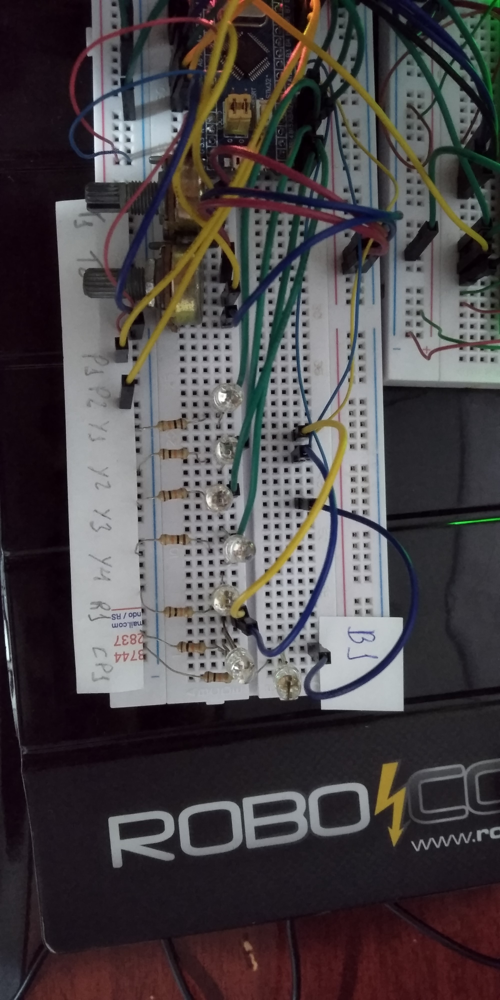
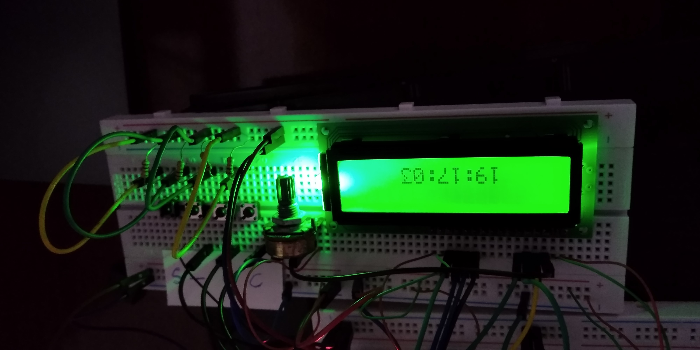

# Trabalho final - Automação 1
Firmware de controle para uma máquina de bebidas automática usando STM32F103C8.

## Princípio de funcionamento:
Cápsulas com a bebida desejada são inseridas em um compartimento de mistura. Cada
cápsula tem uma sequência binária de 3 bits pré definida. A sequência guarda as instruções
de preparo da bebida em questão, quantidade de água, de gás carbônico, temperatura,
etc…

A máquina pode funcionar como um purificador, refrigerador e gaseificador de água. Avisos
no display indicam quando deve ser substituído o filtro de água ou o cilindro de gás
carbônico.

## Diagrama de Blocos do Sistema:

## Descrição:

● P1 - Pressostato de filtro de água saturado, contato NF, abre se filtro saturado.

● B1 - Bomba de alimentação de água, saída PWM (0..100%).

● P2 - Pressostato de cilindro de CO2 vazio, contato NF, abre se cilindro vazio.

● Heater: Aquecedor com controle proporcional.

    ○ R1 - Aquecimento resistivo, saída PWM (0..100%).
  
    ○ T1 - Sensor de temperatura analógico, 5..100ºC (5mV/ºC).
  
● Cooler: Refrigerador com controle proporcional.

    ○ CP1 - Compressor de refrigeração, saída PWM (0..10%).
    
    ○ T1 - Sensor de temperatura analógico, 5..50ºC (5mV/ºC).

● Y1 - Válvula de para alimentação de água quente.

● Y2 - Válvula de para alimentação de água gelada.

● Y3 - Válvula de para alimentação de água natural.

● Y4 - Válvula de para alimentação de CO2.

● Bn1- Leitor óptico para detecção do tipo de cápsula:

    ○ Tipo 1 - Água (Quente, Natural ou Gelada - seleção do usuário).

    ○ Tipo 2 - Água com Gás

      ■ 3 seg. com água gelada a 15ºC.

      ■ 1,5 seg. de CO2

    ○ Tipo 3 - Chá Gelado

      ■ 2,7 seg. com água gelada a 20ºC.

    ○ Tipo 4 - Chá Quente

      ■ 2,7 seg. com água quente a 60ºC.

    ○ Tipo 5 - Refrigerante

      ■ 4 seg. com água gelada a 17ºC.

      ■ 2,56 seg. de CO2

## Interface Homem-Máquina:

A interface contem um display de LCD 16x2 e 4 botões. A interface apresenta em repouso um relógio digital.

    Teclado:
    
      C: Cancelar, voltar
      
      +: Navegação de menus e incremento.
      
      -: Navegação de menus e decremento.
      
      S: Entrar no menu, confirmar alteração.

## Imagens da montagem do sistema

### Visão geral

### Botões

### Entradas e saídas

### Display

